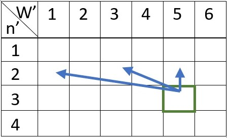

<h1 align=center>Задача о ранце (ограниченном)</h1>

## Используемые средства:
### 1. С++
### 2. Wolfram Mathematica
## Методы решения
### 1. Метод ветвей и границ
*Метод ветвей и границ является вариацией метода полного перебора с той разницей, что исключаются заведомо неоптимальные ветви дерева полного перебора.*

### 2. Динамическое программирование
*Подход динамического программирования состоит в том, что если при решении исходной задачи часто решаются одинаковые подзадачи, то имеет смысл сохранять решение таких подзадач, сократив тем самым количество вычислений*
<body>
  

    
    
    
    
  

 </body>

